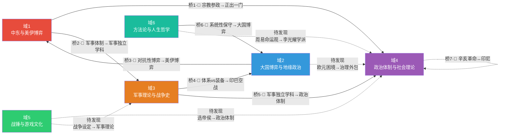

# 双尾彗星知识图谱

## 节点说明

| 节点 | 颜色 | 知识条目数 | 活跃度 |
|------|------|-----------|--------|
| 域1 | 🔴红 | 最多（原4板块） | 日更 |
| 域2 | 🔵蓝 | 多（原6板块） | 日更 |
| 域3 | 🟠橙 | 多（原9板块） | 周更 |
| 域4 | 🟣紫 | 多（原7板块） | 周更 |
| 域5 | 🟢绿 | 少（原3板块） | 月更 |
| 域6 | 🟢青 | 多（原10板块） | 周更 |

## 线型说明

| 线型 | 含义 |
|------|------|
| 实线 → | 已建桥接（有证据链） |
| 虚线 ⇢ | 待探索桥接 |
